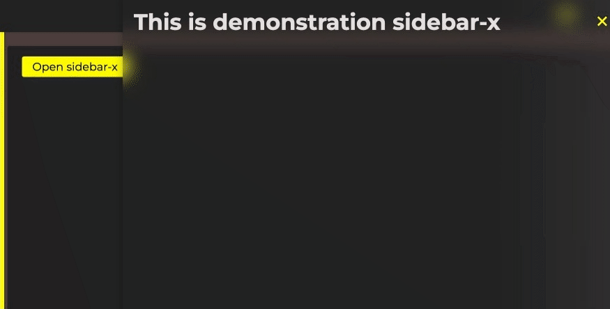
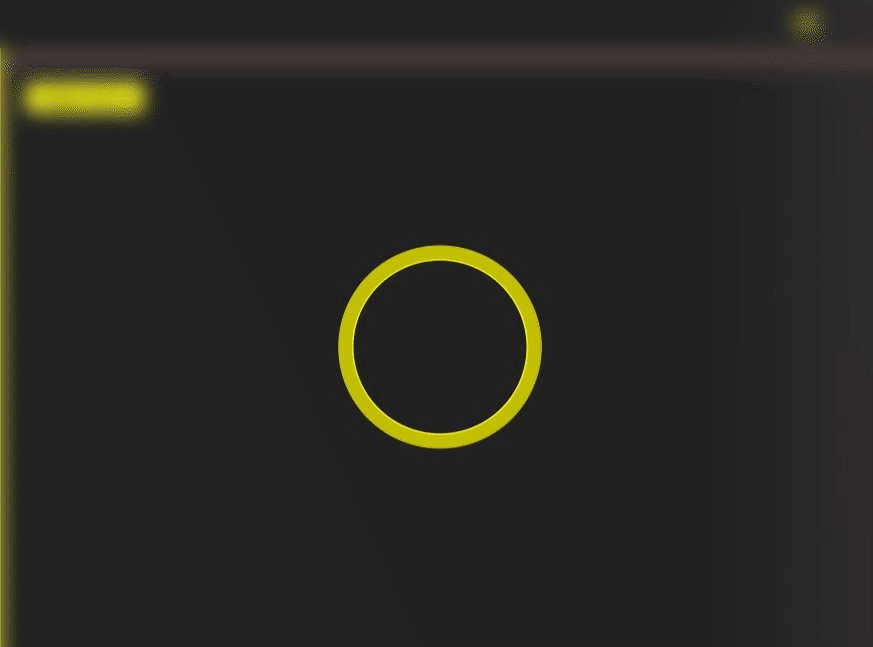

<h1 style="display: flex; align-items: center;">
    xPWA 
    <i>version 0.7.9</i>
</h1>

<code>https://cdn.jsdelivr.net/npm/xpwa@latest/dist/xpwa.min.js</code>
<code><a href="https://xpwa.webnet.kz">Documentation</a></code>

<h3>xPWA - x Progressive WEB Application</h3>

xPWA is a powerful JavaScript library for building web applications, heavily leveraging web components and the Shadow DOM. The library provides a set of ready-to-use HTML components with rich functionality, each having its own isolated styles and animations.

<h4>Key features:</h4>

Use of web components and Shadow DOM for code and style encapsulation.

A rich set of ready-to-use HTML components.

Isolated styles and animations for each component.

Minified version for performance optimization.

Open distribution.

Custom cursor for PC.

and more...

<h2>HTML components</h2>
<ul>
    <li>
        <ul>
            <li><h3>Core components</h3></li>
            <li><b>content-x</b></li>
            <li><b>block-x</b></li>
            <li><b>header-x</b></li>
            <li><b>footer-x</b></li> 
            <li><b>menu-x</b></li>
            <li><b>stub-x</b></li>
            <li>
                <ul>
                    <li><b>burger-x</b></li>
                    <code>
                        
                    </code>
                </ul>
            </li>
            <li><b>button-x</b></li>
            <li><b>close-x</b></li>
        </ul>
    </li>
    <li>
        <ul>
            <li><h3>Sliders</h3></li>
            <li><b>slider-x</b></li>
            <li><b>slide-x</b></li>
            <li><b>dot-x</b></li>
            <li><b>dots-container-x</b></li>
            <li><b>back-slide-x</b></li>
            <li><b>next-slide-x</b></li>
            <code>
                
            </code>
        </ul>
    </li>
    <li>
        <ul>
            <li><h3>Navigation</h3></li>
            <li><b>nav-x</b></li>
            <code>
                
            </code>
            <li><b>sidebar-x</b></li>
            <code>
                
            </code>
        </ul>
    </li>
    <li>
        <ul>
            <li><h3>Messages</h3></li>
            <li><b>tos-x</b></li>
            <li><b>modal-x</b></li>
        </ul>
    </li>
    <li>
        <ul>
            <li><h3>Decorative elements</h3></li>
            <li><b>card-3d-x</b></li>
        </ul>
    </li>
    <li>
        <ul>
            <li><h3>Progress elements</h3></li>
            <li><b>progress-bar-x</b></li>
            <code>
                
            </code>
            <li><b>preloader-x</b></li>
            <code>
                
            </code>
        </ul>
    </li>
    <li>
        <ul>
            <li><h3>Interactive elements</h3></li>
            <li><b>top-x</b></li>
            <li><b>phone-x</b></li>
        </ul>
    </li>
</ul>

<h5>Author:</h5>

WebNet (@webnetkz)

<h4>GPL-3 <a href="LICENSE">LICENSE</a>.</h4>

